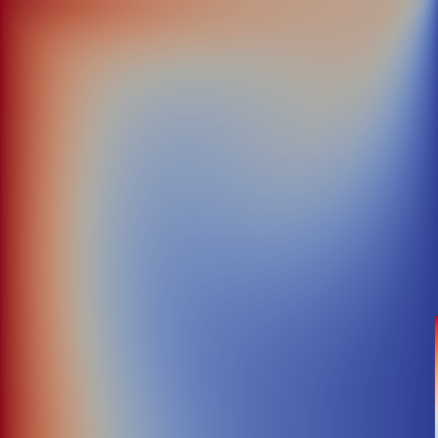

# Lid Driven Cavity with Buoyancy Effects Solution with Stream-function Vorticity Approach
Lid driven cavity problem solved using stream function vorticity approach. Buoyant forces are considered and energy equation is also solved on top of transport and continuity equations. 

$$
\frac{\partial U}{\partial X} + \frac{\partial V}{\partial Y} = 0
$$

$$
\frac{\partial U}{\partial \tau} + U\frac{\partial U}{\partial X} + V\frac{\partial U}{\partial Y} = -\frac{\partial P^\star}{\partial X} + \frac{1}{Re}(\frac{\partial^2U}{\partial X^2} + \frac{\partial^2 U}{\partial Y^2})
$$

$$
\frac{\partial V}{\partial \tau} + U\frac{\partial V}{\partial X} + V\frac{\partial V}{\partial Y} = -\frac{\partial P^\star}{\partial Y} + \frac{1}{Re}(\frac{\partial^2V}{\partial X^2} + \frac{\partial^2 V}{\partial Y^2}) + Ra\Theta
$$

$$
\frac{\partial \Theta}{\partial \tau} + U\frac{\partial \Theta}{\partial X} + V\frac{\partial \Theta}{\partial Y} = \frac{1}{Pe}(\frac{\partial^2\Theta}{\partial X^2} + \frac{\partial^2\Theta}{\partial Y^2})
$$  

Where $Ra = \frac{Gr}{Re^2}$ and $Pe = RePr$. 

    

